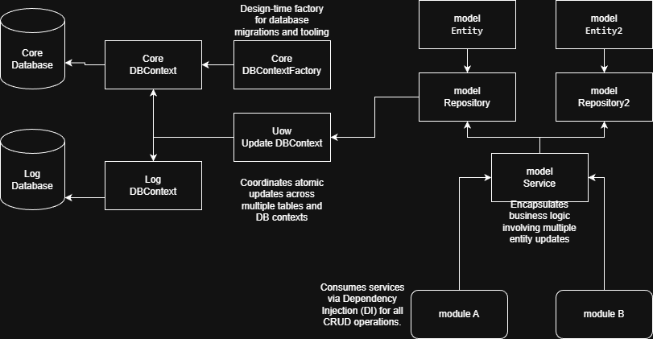

keskeinen-Framework-CSharp
English | 中文說明

🌐 English Description
Overview
This is a lightweight, high-decoupling C# development framework based on Clean Architecture principles. It is designed to handle complex data scenarios involving multiple databases while ensuring data integrity through a coordinated transaction mechanism.

Key Architecture & Features
Dependency Injection (DI) Driven: Core-level support for DI, ensuring all modules are loosely coupled and highly testable.

Multi-DbContext Management: Native support for multiple database contexts (e.g., CoreDB and LogDB).

Advanced Repository Pattern: Encapsulates CRUD operations to keep business logic clean and independent of data access technologies.

Service-Oriented Communication: All inter-module data exchanges are orchestrated through Service layers, preventing direct database leaks.

Unit of Work (UoW): A centralized transaction manager that synchronizes changes across multiple DbContexts, guaranteeing Atomicity.

Data Flow
Request ⮕ Service ⮕ Multiple Repositories ⮕ Unit of Work (Commit) ⮕ Databases

🇹🇼 中文說明
專案概述
這是一個基於 Clean Architecture (潔淨架構) 原則開發的輕量化 C# 開發框架。本框架專為需要處理多資料庫（Multi-DbContext）的複雜場景設計，並透過統一的事務管理機制確保資料的一致性。

核心架構與特色
相依性注入 (DI) 驅動：全框架核心支援 DI，確保模組間的高度解耦與可測試性。

多資料庫上下文管理：原生支援多個 DbContext（例如：核心資料庫 CoreDB 與日誌資料庫 LogDB）。

進階 Repository 模式：封裝 CRUD 操作，使業務邏輯與底層資料存取技術完全分離。

服務導向通訊 (Service Layer)：所有模組間的資料溝通均透過 Service 層進行調度，嚴格控管資料流向。

工作單元 (Unit of Work)：集中式的事務管理機制，能一次性提交多個 DbContext 的變更，確保操作的原子性 (Atomicity)。

資料流向
請求 (Request) ⮕ 服務層 (Service) ⮕ 多個倉儲 (Repositories) ⮕ 工作單元 (UoW 統一提交) ⮕ 資料庫

🛠 Tech Stack
Language: C#

Framework: .NET 8.0+ / EF Core

Pattern: Repository Pattern, Unit of Work, Clean Architecture

📈 Architecture Diagram (UML)

程式碼片段
graph TD
    User((User)) --> Service
    subgraph Logic Layer
        Service --> Repo1[Core Repository]
        Service --> Repo2[Log Repository]
    end
    Repo1 --> UoW[Unit of Work]
    Repo2 --> UoW
    UoW --> DB[(Core Database & Log Database)]
